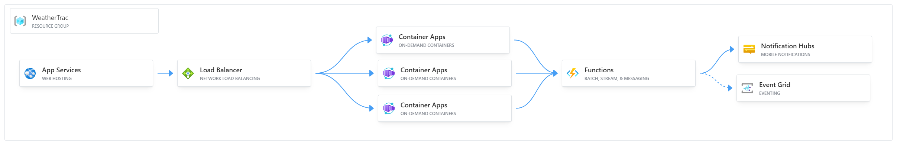

# Weather Tracker Demo - Azure App Services
This project is to demonstrate the usage of Azure App Services, Container Apps, and Azure Functions.

Azure App Services is used for hosting the app which is then auto scaled out based on usage and traffic is managed by a load balancer to keep things running smoothly.

The app then integrates with Azure Functions to send push notifications, using Notification Hub, or emails, using Event Grid, when severe weather events occur.
The container for this site is stored on DockerHub for its cost saving benefits for the purpose of this demo.
