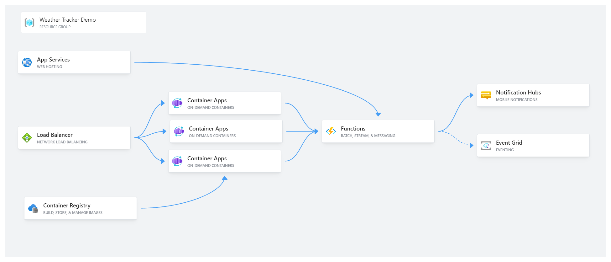

# [Weather Tracker Demo](https://weathertrackerdemo-tj.azurewebsites.net/) - Azure App Services
This project is to demonstrate the usage of Azure App Services, Container Apps, and Azure Functions.

Here I provide two methods for hosting this application, code-only and containerized.
For code only, we can host the application using Azure App Services which provides auto horrizontal scaling.

For containers, we can use Azure Container Apps (or Azure Kubernetes, but I am using Container Apps for cost purposes) to host a docker container that runs our application and scale it as needed.

Either way it is hosted, the app then integrates with Azure Functions to send push notifications (using Notification Hub) or emails (using Event Grid) when severe weather events occur.

The container for this site is stored on [DockerHub](https://hub.docker.com/repository/docker/tdjoy/weathertrackerdemo/general) for its cost saving benefits for the purpose of this demo.

This application utilizes AccuWeather's API for weather information. AccuWeather uses a location key instead of the city name. 
In order to preserve some api calls I cache these keys for a period of time.